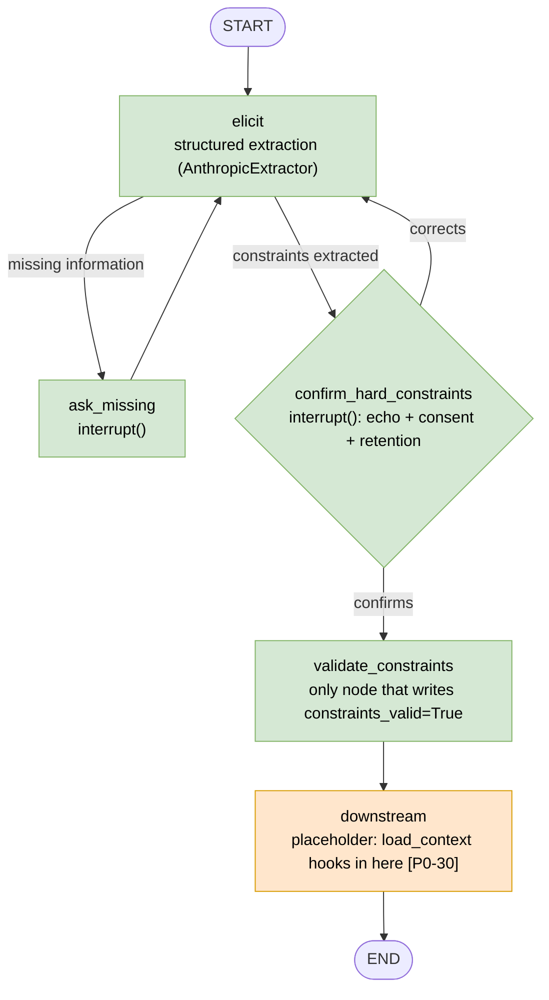
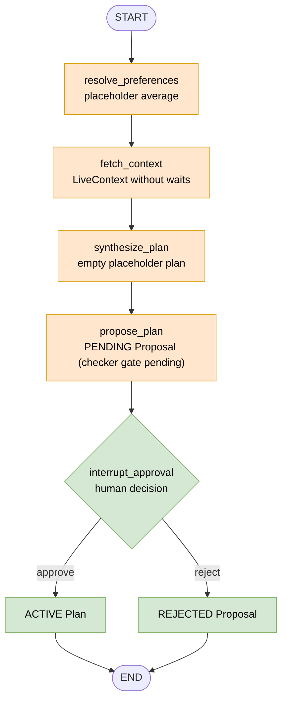
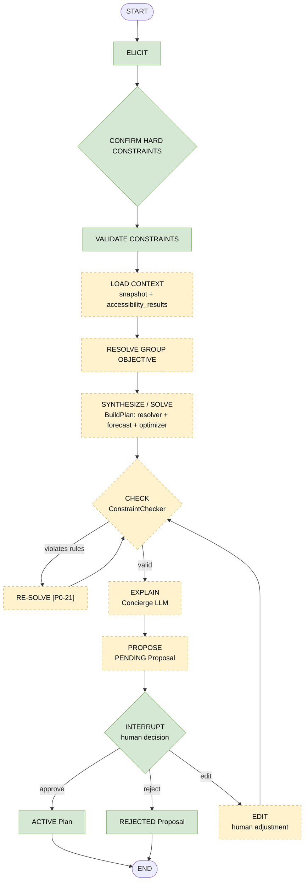
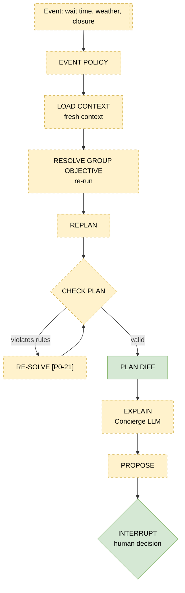

# Agent graph flow (ParkMind)

Green = implemented, orange = partial (placeholder), dashed yellow = target state.

There are four diagrams: the elicitation graph (already implemented), the initial planning graph **as it is today**, the **target** initial planning flow per §35 of the baseline, and the replanning flow per §36. The order of the current planning graph is provisional: P0-30 replaces it with the §35 order.

## 1. Elicitation (implemented, #78)

The LLM only proposes. A new hard constraint does not reach the checker until a person confirms it, and accessibility requires consent and a `retention_policy` (default `session_only`).

## 2. Initial planning: current state

This graph is not yet connected to the elicitation graph. Its order is provisional.

## 3. Initial planning: target (§35)

`RESOLVE GROUP OBJECTIVE` comes **after** `LOAD CONTEXT` because it needs `accessibility_results` (C23). Today `resolve_preferences` runs first; reordering it is part of P0-30.

## 4. Replanning (§36, target)

Today `replanning_graph.py` only has the docstring describing the flow and raises `NotImplementedError`. `RESOLVE GROUP OBJECTIVE` runs again with fresh context, and `RE-SOLVE` is part of the contract.

`PLAN DIFF` is green because `diff_plans` already exists; the graph node that calls it is still pending.
