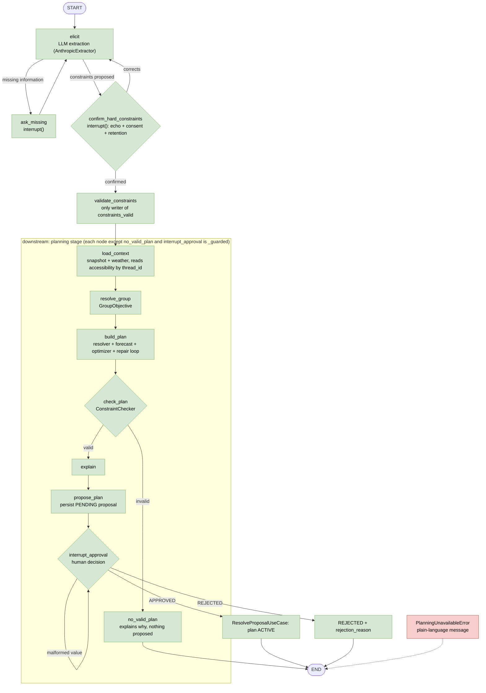
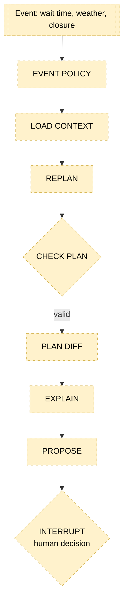

# Agent graph flow (ParkMind)

Static companion to the interactive pages. Open them in a browser:

- [`agent-graph.html`](agent-graph.html): the animated agent graph. replayable scenarios, step-by-step, with a live state panel.
- [`architecture.html`](architecture.html): the animated architecture stack, with flows, boundaries, implementation status and a "Safety & control" overlay showing which components enforce each control.

Green = implemented, dashed yellow = target / stub.

## 1. Initial planning graph (implemented: P0-29 + P0-30)

`build_initial_planning_graph()` compiles the elicitation graph and mounts the planning stage as its `downstream` subgraph. Both share `ParkMindState` and the parent's checkpointer.

The LLM only proposes. A hard constraint does not reach the checker until a person confirms it, and accessibility needs consent plus a `retention_policy` (default `session_only`). The plan is activated only by `interrupt_approval` on the resumed, human-driven path.

Notes:

- `propose_plan` is reachable only through the valid edge of `check_plan` and re-asserts `check_result.valid`.
- Nothing before an `interrupt()` has a side effect: LangGraph re-runs a node from the top on resume.
- `EDITED` decisions are rejected with an error until P0-32.
- State holds only `accessibility_ref` (guest ids) [C19].

## 2. Replanning (target, §36)

`replanning_graph.py` only has the docstring and `build_replanning_graph()` raises `NotImplementedError`. `diff_plans` exists; the node that calls it does not.

