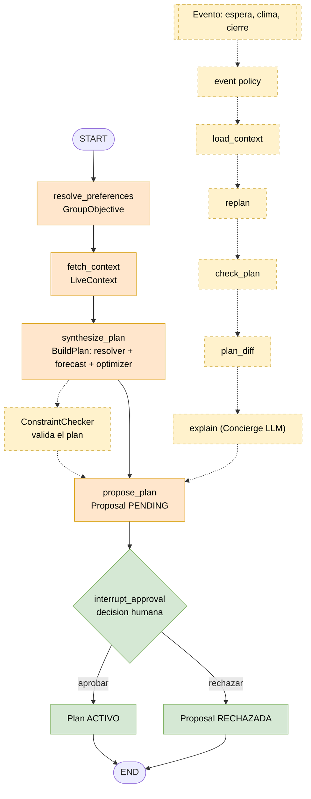

# Flujo del grafo de agentes (ParkMind)

Verde = implementado, naranja = parcial (placeholder), amarillo punteado = estado objetivo.

```mermaid
flowchart TD
  S([START]) --> A["resolve_preferences<br/>GroupObjective"]:::partial
  A --> B["fetch_context<br/>LiveContext"]:::partial
  B --> C["synthesize_plan<br/>BuildPlan: resolver + forecast + optimizer"]:::partial
  C -.-> CK["ConstraintChecker<br/>valida el plan"]:::target
  CK -.-> D
  C --> D["propose_plan<br/>Proposal PENDING"]:::partial
  D --> E{"interrupt_approval<br/>decision humana"}:::impl
  E -- aprobar --> F["Plan ACTIVO"]:::impl
  E -- rechazar --> G["Proposal RECHAZADA"]:::impl
  F --> Z([END])
  G --> Z

  EV[["Evento: espera, clima, cierre"]]:::target -.-> EP["event policy"]:::target
  EP -.-> LC["load_context"]:::target
  LC -.-> RP["replan"]:::target
  RP -.-> CP["check_plan"]:::target
  CP -.-> PD["plan_diff"]:::target
  PD -.-> EX["explain (Concierge LLM)"]:::target
  EX -.-> D

  classDef impl fill:#d5e8d4,stroke:#82b366,color:#000
  classDef partial fill:#ffe6cc,stroke:#d79b00,color:#000
  classDef target fill:#fff2cc,stroke:#d6b656,stroke-dasharray:5 5,color:#000
```
