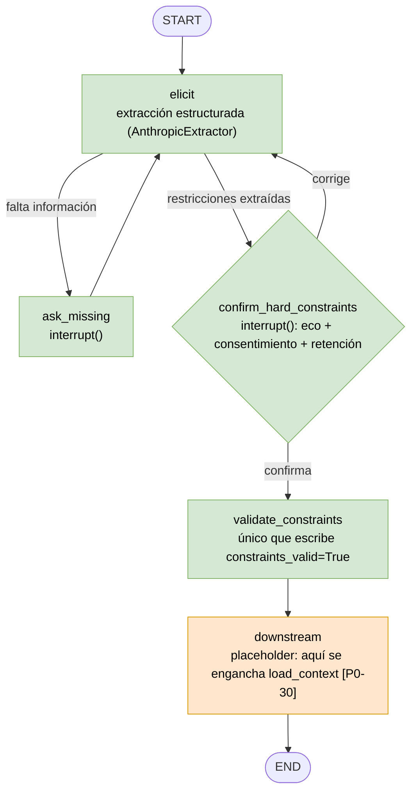
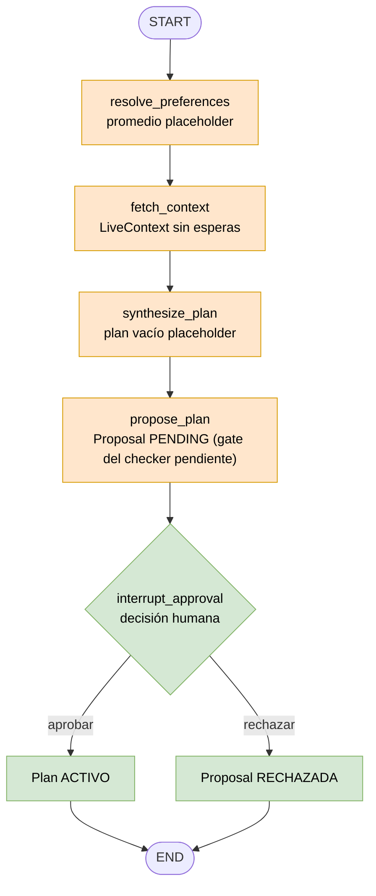
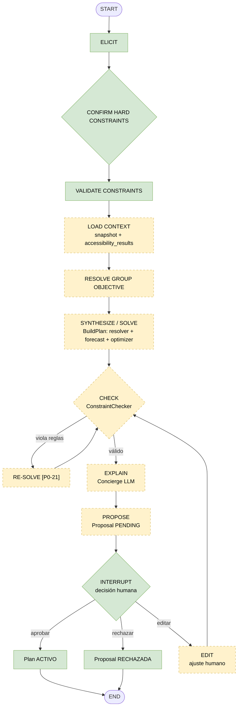
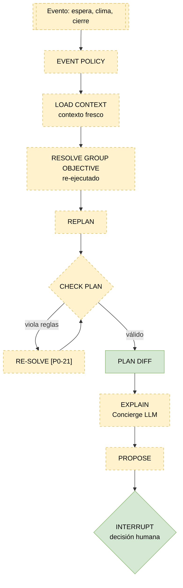

# Flujo del grafo de agentes (ParkMind)

Verde = implementado, naranja = parcial (placeholder), amarillo punteado = estado objetivo.

Hay tres diagramas: el grafo de elicitación (ya implementado), el grafo de planificación **tal como está hoy** y el flujo **objetivo** según §35 del baseline. El orden del grafo de planificación actual es provisional: P0-30 lo reemplaza por el orden de §35.

## 1. Elicitación (implementado, #78)

El LLM solo propone. Una restricción dura nueva no llega al checker sin que una persona la confirme, y la accesibilidad exige consentimiento y `retention_policy` (por defecto `session_only`).

## 2. Planificación inicial: estado actual

Este grafo todavía no está conectado al de elicitación. Su orden es provisional.

## 3. Planificación inicial: objetivo (§35)

`RESOLVE GROUP OBJECTIVE` va **después** de `LOAD CONTEXT` porque necesita `accessibility_results` (C23). Hoy `resolve_preferences` va primero; reordenarlo es parte de P0-30.

## 4. Replanning (§36, objetivo)

Hoy `replanning_graph.py` solo tiene el docstring con el flujo y lanza `NotImplementedError`. `RESOLVE GROUP OBJECTIVE` se vuelve a ejecutar con el contexto fresco, y `RE-SOLVE` forma parte del contrato.

`PLAN DIFF` aparece en verde porque `diff_plans` ya existe; el nodo del grafo que lo invoca sigue pendiente.
